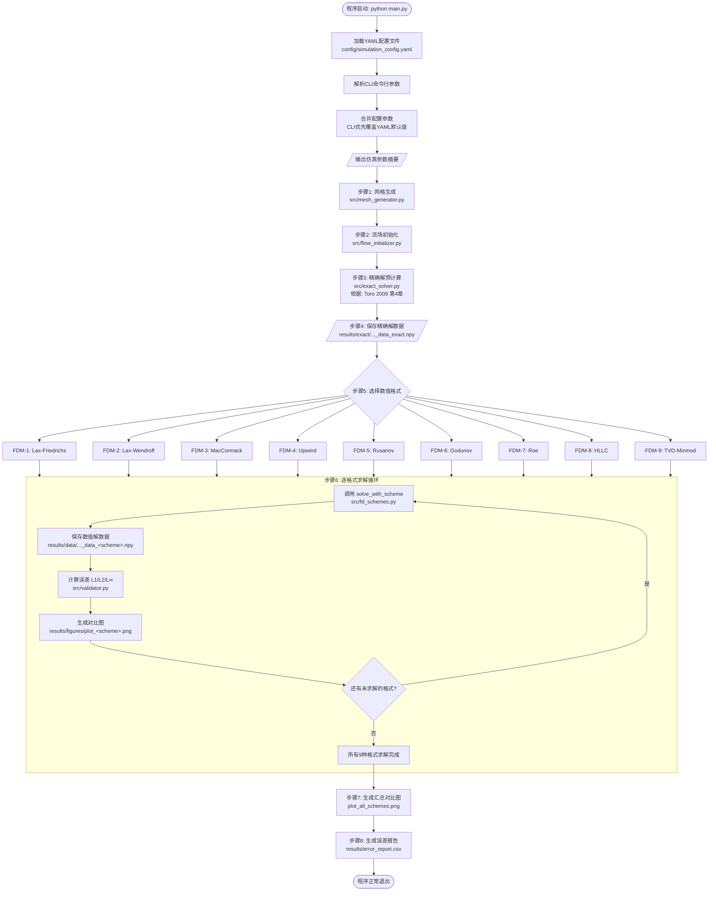
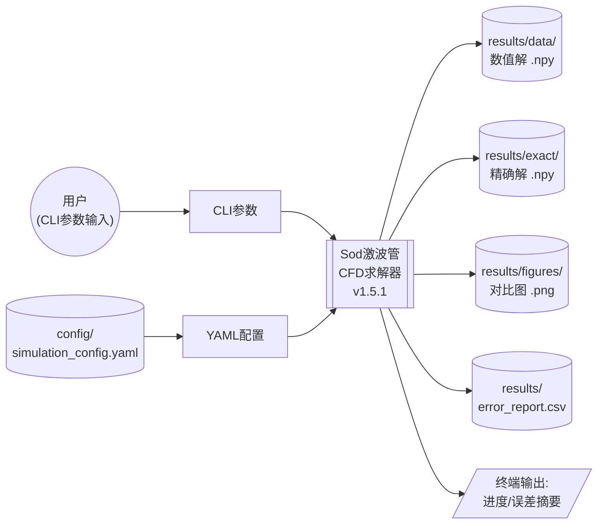
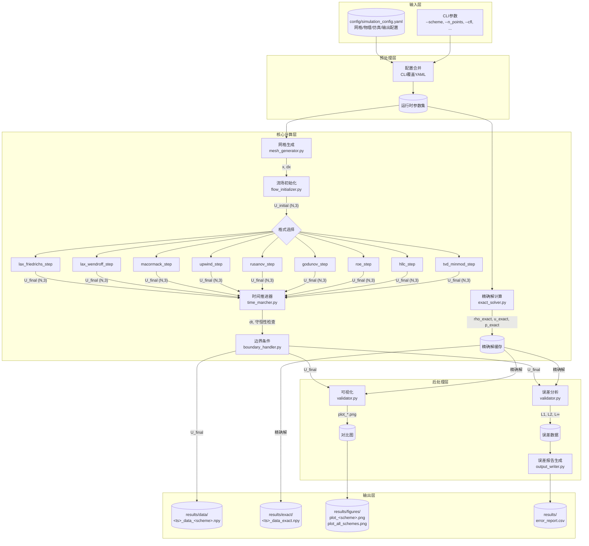
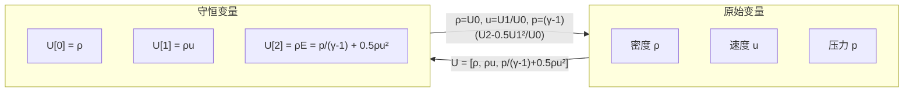

# 业务流程图说明

## 一维Sod激波管CFD数值格式对比项目

| 项目 | 内容 |
|------|------|
| 文档编号 | WF-SOD-CFD-1.5 |
| 版本号 | 1.5.1 |
| 编制日期 | 2026-05-17 |
| 编制人 | CFD课程项目组 |
| 绘图工具 | Mermaid (Markdown内嵌) |

---

## 1. 概述

本文档使用Mermaid图表语言描述一维Sod激波管CFD数值格式对比项目的核心业务流程，包括：

1. **仿真主流程图**：展示从配置加载到结果输出的完整仿真流程
2. **单个格式求解流程图**：展示一种数值格式的时间推进求解详细流程
3. **数据流图**：展示数据在各模块间的输入、转换与输出关系

所有流程图均可在支持Mermaid渲染的Markdown阅读器（如GitHub、Typora、VS Code with Mermaid插件）中直接查看。

---

## 2. 仿真主流程图

### 2.1 流程说明

仿真主流程覆盖从程序启动到结果输出的完整生命周期。程序首先加载并合并配置参数（YAML文件 + CLI参数），然后根据配置执行网格生成、流场初始化、精确解预计算、多格式循环求解、误差分析与可视化等步骤。

该流程的设计原则是：
- **精确解预计算**：精确解与具体格式无关，应在格式求解之前一次性计算并缓存，避免重复计算（文献依据：Toro, 2009[2]）。
- **格式求解循环**：不同格式独立求解，一种格式的失败不应影响其他格式的执行。
- **错误报告汇总**：所有格式求解完成后，统一生成误差对比报告（文献依据：Sod, 1978[1]）。

### 2.2 Mermaid流程图



### 2.3 流程关键节点说明

| 节点 | 对应模块 | 输入 | 输出 | 文献依据 |
|------|---------|------|------|---------|
| 网格生成 | `mesh_generator.py` | n_points, x_left, x_right | x数组, dx标量 | LeVeque(1992)[4] |
| 流场初始化 | `flow_initializer.py` | x, 左右状态, gamma | U初始守恒变量 | Sod(1978)[1] |
| 精确解预计算 | `exact_solver.py` | x, t_final=0.2, gamma | rho/u/p_exact | Toro(2009)[2]第4章 |
| 格式求解 | `fd_schemes.py` | U, x, dx, t_final, cfl | U_final, t, n_steps | 各格式对应文献 |
| 误差分析 | `validator.py` | U_final, rho/u/p_exact | L1/L2/L∞误差 | ASME V&V 20-2009 |
| 可视化 | `validator.py` | x, U_final, 精确解 | PNG对比图 | Sod(1978)[1] |

---

## 3. 单个格式求解流程图

### 3.1 流程说明

单个格式的求解是一个**显式时间推进循环**，核心结构为：

1. **CFL自适应时间步长**：每个时间步根据当前流场的最大特征波速计算满足CFL条件的$\Delta t$（文献依据：LeVeque, 1992[4]）。
2. **格式步进函数**：调用格式特定的`xxx_step(U, dx, dt, gamma)`计算下一时间层的$U^{n+1}$。
3. **边界条件施加**：在每次步进后更新两端边界节点的值（边界条件，类型可配置）。
4. **守恒性监控**：定期检查质量、动量和总能是否守恒（文献依据：Laney, 1998[3]）。
5. **终止判断**：当$t \ge t_{\text{final}}$时，以调整后的$\Delta t = t_{\text{final}} - t$完成最后一步。

### 3.2 Mermaid流程图

```mermaid
flowchart TD
    StartSolver([solve_with_scheme 入口]) --> CheckScheme{格式名称是否<br/>在FD_SCHEMES注册表中?}
    CheckScheme -->|否| ErrScheme[/抛出 ValueError<br/>列出可用格式/]
    CheckScheme -->|是| ResetCounter{是否为MacCormack格式?}

    ResetCounter -->|是| ResetMC[重置交替方向计数器<br/>_macormack_step_counter = 0]
    ResetCounter -->|否| InitVars
    ResetMC --> InitVars

    InitVars[初始化变量:<br/>U = U_initial, t = 0.0, n_steps = 0] --> TimeLoop

    subgraph TimeLoop [显式时间推进循环]
        direction TB
        T1[计算自适应时间步长 dt<br/>src/time_marcher.py::compute_dt<br/>dt = CFL * dx / max&#40;|u|+c&#41;]
        T1 --> T2{t + dt > t_final?}
        T2 -->|是| T3[调整 dt = t_final - t]
        T2 -->|否| T4
        T3 --> T4

        T4[调用格式步进函数<br/>U_new = xxx_step&#40;U, dx, dt, gamma&#41;]
        T4 --> T5[施加边界条件<br/>src/boundary_handler.py<br/>apply_boundary_condition&#40;U_new&#41;]

        T5 --> T6[更新: U = U_new, t += dt, n_steps += 1]

        T6 --> T7{n_steps % 100 == 0?}
        T7 -->|是| T8[/输出进度: 步数/时间/dt/]
        T7 -->|否| T9
        T8 --> T9{守恒性检查?}
        T9 --> T10[check_conservation&#40;U, U_initial, dx&#41;]
        T10 --> T11{质量/动量/能量<br/>变化 < 1e-6?}
        T11 -->|否| Warn[/输出守恒性警告/]
        T11 -->|是| T12
        Warn --> T12
        T12{t >= t_final?}
        T12 -->|否| T1
        T12 -->|是| FinalCheck
    end

    FinalCheck[最终守恒性检查] --> Return([返回 U_final, t, n_steps])
```

### 3.3 各格式步进函数的核心计算流程

```mermaid
flowchart LR
    subgraph FDM_Step [格式步进函数 xxx_step&#40;U, dx, dt, gamma&#41;]
        direction TB
        A1[计算通量 F&#40;U&#41;<br/>compute_flux] --> A2{格式类型}

        A2 -->|中心差分| C1
        A2 -->|迎风/通量分裂| C2
        A2 -->|Riemann求解器| C3
        A2 -->|TVD/MUSCL| C4

        subgraph C1 [Lax-Friedrichs / Lax-Wendroff / MacCormack]
            LF["Lax-Friedrichs:<br/>U_new = 0.5*(U_{i+1}+U_{i-1}) - dt/(2dx)*(F_{i+1}-F_{i-1})"]
            LW["Lax-Wendroff:<br/>二阶修正项 + Jacobian矩阵计算"]
            MC["MacCormack:<br/>预估(前差) + 校正(后差) + 平均<br/>交替方向策略"]
        end

        subgraph C2 [Upwind / Rusanov]
            UP["Upwind:<br/>Steger-Warming通量分裂<br/>F = F⁺ + F⁻"]
            RU["Rusanov:<br/>局部Lax-Friedrichs<br/>alpha = max(|u|+c)"]
        end

        subgraph C3 [Godunov / Roe / HLLC]
            GD["Godunov:<br/>精确Riemann解通量<br/>brentq迭代求解p*"]
            RO["Roe:<br/>Roe平均状态<br/>特征分解 + 熵修复"]
            HL["HLLC:<br/>三波模型<br/>S_L, S*, S_R 波速估计"]
        end

        subgraph C4 [TVD-Minmod]
            TV["MUSCL重构:<br/>U^L_{i+1/2}, U^R_{i+1/2}<br/>Minmod限制器<br/>Roe通量"]
        end
    end
```



### 3.4 时间步长计算

CFL自适应时间步长的计算公式（文献依据：LeVeque, 1992[4], 第4章）：

$$\Delta t = \text{CFL} \cdot \frac{\Delta x}{\max_i (|u_i| + c_i)}$$

其中$c_i = \sqrt{\gamma p_i / \rho_i}$为当地声速，$\max_i(|u_i|+c_i)$为全场最大特征波速。

**CFL数选择**（文献依据：Laney, 1998[3]）：
- 默认值0.8，在稳定性和效率之间取得平衡
- 一阶格式（Lax-Friedrichs）可承受CFL数接近1.0
- 二阶格式（Lax-Wendroff, MacCormack）建议CFL=0.8以防止间断附近振荡放大
- CFL数过小（<0.3）会增加不必要的计算时间

---

## 4. 数据流图

### 4.1 顶层数据流图（DFD Level 0）



### 4.2 详细数据流图（DFD Level 1）



### 4.3 核心数据结构

| 数据名称 | 类型 | 形状 | 字段说明 | 产生模块 | 消费模块 |
|---------|------|------|---------|---------|---------|
| `x` | ndarray(float64) | `(N,)` | 网格节点坐标，$x_i \in [0,1]$ | mesh_generator | flow_initializer, fd_schemes, exact_solver, validator |
| `dx` | float | 标量 | 网格间距 $\Delta x$ | mesh_generator | fd_schemes, time_marcher, validator |
| `U` | ndarray(float64) | `(N, 3)` | 守恒变量 $[\rho, \rho u, \rho E]$ | flow_initializer (初始), fd_schemes (每步更新) | fd_schemes, exact_solver, validator, output_writer |
| `F` | ndarray(float64) | `(N, 3)` | 通量向量 $[\rho u, \rho u^2+p, u(\rho E+p)]$ | fd_schemes内部计算 | fd_schemes（格式步进） |
| `dt` | float | 标量 | CFL自适应时间步长 | time_marcher | fd_schemes |
| `rho_exact` | ndarray(float64) | `(N,)` | 精确密度分布 | exact_solver | validator |
| `u_exact` | ndarray(float64) | `(N,)` | 精确速度分布 | exact_solver | validator |
| `p_exact` | ndarray(float64) | `(N,)` | 精确压力分布 | exact_solver | validator |
| `errors` | dict | `{var: {L1, L2, Linf}}` | 3变量 x 3范数 = 9个误差值 | validator | output_writer |

### 4.4 守恒变量与原始变量的转换

数据在守恒变量$[\rho, \rho u, \rho E]$和原始变量$[\rho, u, p]$之间的转换关系（文献依据：Laney, 1998[3], 第2章）：

**守恒变量 -> 原始变量**：
$$\rho = U_0, \quad u = U_1 / U_0, \quad p = (\gamma-1)(U_2 - 0.5 U_1^2 / U_0)$$

**原始变量 -> 守恒变量**：
$$U_0 = \rho, \quad U_1 = \rho u, \quad U_2 = \frac{p}{\gamma-1} + \frac{1}{2}\rho u^2$$



---

## 5. 参考文献

[1] SOD G A. A survey of several finite difference methods for systems of nonlinear hyperbolic conservation laws[J]. Journal of Computational Physics, 1978, 27(1): 1-31.

[2] TORO E F. Riemann solvers and numerical methods for fluid dynamics: a practical introduction[M]. 3rd ed. Berlin: Springer, 2009.

[3] LANEY C B. Computational gasdynamics[M]. Cambridge: Cambridge University Press, 1998.

[4] LEVEQUE R J. Numerical methods for conservation laws[M]. 2nd ed. Basel: Birkhauser, 1992.

[5] HARTEN A. High resolution schemes for hyperbolic conservation laws[J]. Journal of Computational Physics, 1983, 49(3): 357-393.

[6] OneFlow-CFD Documentation. Sod shock tube example[EB/OL]. https://oneflow-cfd.readthedocs.io/en/latest/cfd/examples/sod.html.

---

**文档控制信息**：
- 编制：CFD课程项目组 | 2026-05-17
- 审核：--（待审核）
- 批准：--（待批准）

**附录：Mermaid渲染说明**

本文档中的Mermaid流程图需要在支持Mermaid的Markdown渲染器中查看。推荐以下方式：

1. **GitHub/GitLab**：直接推送至仓库，在线预览自动渲染
2. **Typora**：桌面Markdown编辑器，原生支持Mermaid
3. **VS Code**：安装"Markdown Preview Mermaid Support"插件
4. **在线渲染**：访问 https://mermaid.live 粘贴代码块查看